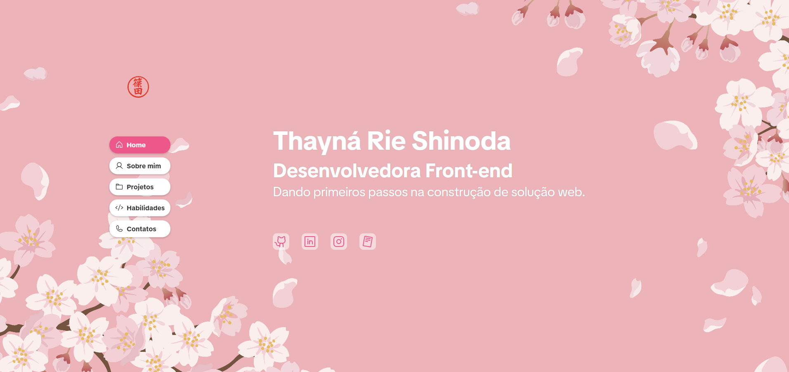

# 🌸 Portfolio Thayná Rie Shinoda

<div align="center">



**Um portfolio moderno e responsivo desenvolvido com React + Vite**

[🚀 Ver Demo](https://portfolio2025-gamma-vert.vercel.app/) • [📧 Contato](mailto:thayrieshinoda@gmail.com)

</div>

---

## 📋 Sobre o Projeto

Este é meu portfolio pessoal desenvolvido com React e Vite, apresentando uma interface moderna e totalmente responsiva. O projeto conta com navegação suave, design inspirado em cerejeiras japonesas (sakura) e integração com EmailJS para contato direto.

### ✨ Destaques

- 🎨 **Design Moderno**: Interface limpa com tema sakura
- 📱 **Totalmente Responsivo**: Adaptado para desktop, tablet e mobile
- 🚀 **Performance Otimizada**: Construído com Vite para carregamento rápido
- 📧 **Contato Funcional**: Integração com EmailJS
- 🎯 **Navegação Suave**: Scroll snap e transições fluidas
- 📊 **Carrossel de Projetos**: Exibição interativa usando Swiper.js

---

## 🛠️ Tecnologias Utilizadas

### Core

- **React 19.1.0** - Biblioteca JavaScript para interfaces
- **Vite 7.0.4** - Build tool e dev server ultra-rápido
- **CSS Modules** - Estilização modular e scoped

### Bibliotecas

- **@emailjs/browser** - Envio de emails sem backend
- **@phosphor-icons/react** - Ícones modernos
- **Swiper** - Carrossel de projetos
- **ESLint** - Linting e qualidade de código

---

## 📁 Estrutura do Projeto

```
src/
├── assets/              # Imagens e recursos estáticos
│   ├── background_cherry_blossom.jpg
│   ├── hanko_shinoda.png
│   └── projetos/        # Screenshots dos projetos
├── components/          # Componentes reutilizáveis
│   ├── Section/         # Wrapper para seções
│   └── Sidebar/         # Navegação lateral
├── pages/               # Páginas do portfolio
│   ├── Home/            # Página inicial
│   ├── Sobre/           # Sobre mim
│   ├── Projetos/        # Portfólio de projetos
│   ├── Habilidades/     # Skills e tecnologias
│   └── Contatos/        # Formulário de contato
├── App.jsx              # Componente principal
├── main.jsx             # Entry point
└── index.css            # Estilos globais
```

---

## 🎨 Funcionalidades

### 🏠 **Home**

- Apresentação pessoal com design atrativo
- Navegação intuitiva

### 👩‍💻 **Sobre**

- Informações pessoais e profissionais
- História e objetivos

### 🚀 **Projetos**

- Carrossel interativo com Swiper.js
- Links para repositórios e demos
- Screenshots dos projetos

### 🛠️ **Habilidades**

- Tecnologias organizadas por categorias
- Ícones representativos

### 📞 **Contato**

- Formulário funcional com EmailJS
- Validação de campos

---

## 🎯 Destaques Técnicos

### Performance

- ⚡ Vite para build ultra-rápido
- 🔄 Lazy loading de componentes
- 📦 Bundle otimizado

### UX/UI

- 🎨 Design system consistente
- 🌸 Tema sakura personalizado
- 📱 Mobile-first approach
- ♿ Acessibilidade considerada

### Código

- 🧩 Componentes modulares
- 📋 CSS Modules para styling
- 🔍 ESLint para qualidade
- 📝 Código bem documentado

---

## 🤝 Contribuições

Contribuições são sempre bem-vindas! Se você tem sugestões de melhorias:

1. Fork o projeto
2. Crie uma branch para sua feature (`git checkout -b feature/AmazingFeature`)
3. Commit suas mudanças (`git commit -m 'Add some AmazingFeature'`)
4. Push para a branch (`git push origin feature/AmazingFeature`)
5. Abra um Pull Request

---

## 📄 Licença

Este projeto está sob a licença MIT. Veja o arquivo [LICENSE](LICENSE) para mais detalhes.

---

## 👩‍💻 Autora

**Thayna Rie Shinoda**

- 💼 LinkedIn: [linkedin.com/in/thayná-rie-shinoda-135b36359](https://www.linkedin.com/in/thayn%C3%A1-rie-shinoda-135b36359/)
- 📧 Email: thayrieshinoda@gmail.com
- 🐱 GitHub: [@ThaynaShinoda](https://github.com/ThaynaShinoda)

---

**⭐ Se você gostou do projeto, deixe uma estrela! ⭐**

Desenvolvido com 💖 e ☕ por [Thayná Shinoda](https://github.com/ThaynaShinoda)

</div>
